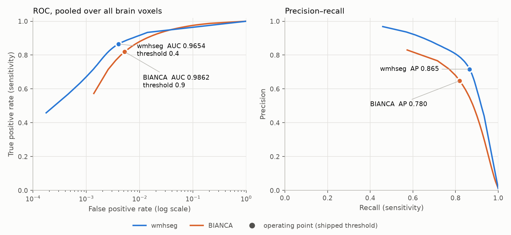

# wmhseg

WMH segmentation (white matter hyperintensities) on FLAIR, in one command.
A 2D U-Net with Bottleneck Attention Modules (BAM), shipped with its weights.

**See it before you install it: [the QC page](https://mendeltem.github.io/wmhseg/)** —
reference, BIANCA and `wmhseg` side by side on all 110 public test cases — scroll through every
slice, step through the patients with the arrow keys, worst cases first.

```bash
pip install git+https://github.com/mendeltem/wmhseg
wmhseg --flair FLAIR_brain_biascorr.nii.gz --out wmh.nii.gz
```

The weights (7.7 MB) are part of the package. There is no separate download step.

## Input: what the model expects

The FLAIR must be **brain-extracted and bias-corrected**. That is exactly what the
model was trained on, and feeding it a raw FLAIR gives a plausible-looking but wrong
result. `wmhseg` checks the input: if more than 40 % of the volume is greater than
zero it stops with a message instead of computing nonsense (`--ungeprueft` overrides).

The tool does **no** preprocessing of its own -- no HD-BET, no FSL, no external
programs. It is plain Python (torch, nibabel, numpy, scipy). Prepare the image with
whatever pipeline you already trust; a common one is HD-BET followed by N4/FAST bias
correction.

```bash
wmhseg --flair flair.nii.gz --out wmh.nii.gz          # brain mask derived from the FLAIR
wmhseg --flair flair.nii.gz --maske mask.nii.gz --out wmh.nii.gz
wmhseg --flair flair.nii.gz --out wmh.nii.gz --prob prob.nii.gz --cpu
wmhseg --version
```

Output is a `uint8` NIfTI (0/1) on the grid and affine of the input FLAIR.

## What it does, step by step

1. Brain mask: from `--maske`, or `binary_fill_holes(flair > 0)`.
2. z-normalisation **inside the brain mask**, zero outside.
3. In-plane resampling to 1.0 mm, slice direction untouched.
4. A 256x256 crop per axial slice, centred on the centre of mass of the mask.
5. The network, slice by slice.
6. Back to the FLAIR grid, restricted to the brain mask, **then** thresholded (0.40).

Steps 2 and 6 are the ones people get wrong when reimplementing: normalising over the
whole volume, or thresholding before returning to the original grid, both shift the
result measurably.

## Does it compute what it was trained to compute?

`gleichheit.json` in this repository is the evidence: on 12 cases of the public
challenge test set the output of `wmhseg` is **identical** to the output of the
training pipeline -- Dice 1.000000, same shape, same affine, case by case.

Deriving the brain mask from the FLAIR instead of passing one with `--maske` changes
the result slightly: on `sub-070` the two masks agree at Dice 0.9989. Pass the mask you
used for brain extraction if you want the exact same result twice.

## Quality control: look at every slice yourself

**[mendeltem.github.io/wmhseg](https://mendeltem.github.io/wmhseg/)** is an interactive viewer
(branch `gh-pages`), not a gallery of picked slices. Three linked panels on the same FLAIR —
reference, BIANCA, `wmhseg` — for **all 110 cases** of the public test set:

- **mouse wheel** (or ← →, or the slider) scrolls through the slices, all three panels move together
- **↑ ↓** steps through the patients; the list is sorted worst-first and can be re-sorted
  (where BIANCA wins, largest / smallest lesion load)
- axial / coronal / sagittal, mask opacity, `M` toggles the masks to see the bare FLAIR
- each case opens on its slice with the largest lesion load; a link with `#sub-105` opens that case

The images come from the public [WMH Segmentation Challenge](https://wmh.isi.uu.nl/)
([doi:10.34894/AECRSD](https://doi.org/10.34894/AECRSD), CC BY-NC 4.0) and are shown modified
(brain-extracted, bias-corrected, cropped, 8-bit). No in-house image is published anywhere.

## Evaluation against BIANCA — more than Dice

Dice alone hides *how* a method fails. All numbers below are **paired** (same cases, both methods),
differences come with a 95 % bootstrap interval over cases (10 000 draws); ✓ / ✗ mark an interval that
excludes zero in favour of / against `wmhseg`. BIANCA is FSL BIANCA trained on the same data
(threshold 0.9). Evaluation follows the official challenge rule: reference = label 1, and the
*prediction* is erased on label 2 (other pathology) before counting.

| Group | Metric | What it tells you |
|---|---|---|
| Voxel overlap | Dice, sensitivity, precision, specificity | how much of the lesion volume is right; specificity is computed inside the brain and is near 1 for any method because lesions are < 1 % of the voxels — it is listed for completeness, not as evidence |
| Boundary | HD95, ASSD (mm) | how far the predicted *edges* are from the reference edges — 95th percentile and mean of the symmetric surface distance |
| Volume | AVD (%) | absolute volume difference — what a study using WMH volume actually consumes |
| Lesion level | lesion recall, precision, F1 | connected components; a lesion counts as found if one voxel touches it. Are small lesions found, and how many predicted blobs are false? |
| Threshold-free | ROC AUC, PR AUC | the probability map itself, over all brain voxels, independent of the chosen threshold |

### Public WMH Challenge test set (n = 110) — the shipped weights

This is exactly what `pip install` gives you, on data from a domain the model saw only 60 cases of.

| Metric | wmhseg | BIANCA | paired difference [95% CI] | n |
|---|---|---|---|---|
| Dice ↑ | 0.695 | 0.604 | +0.091 [+0.072; +0.110] ✓ | 110 |
| Sensitivity ↑ | 0.835 | 0.856 | -0.021 [-0.053; +0.011] | 110 |
| Precision ↑ | 0.615 | 0.513 | +0.102 [+0.077; +0.127] ✓ | 110 |
| Specificity ↑ | 0.9958 | 0.9948 | +0.0010 [+0.0005; +0.0016] ✓ | 110 |
| HD95 mm ↓ | 5.97 | 10.22 | -4.25 [-5.67; -2.92] ✓ | 110 |
| ASSD mm ↓ | 1.33 | 2.46 | -1.13 [-1.50; -0.79] ✓ | 110 |
| AVD % ↓ | 48.9 | 133.1 | -84.2 [-114.8; -57.3] ✓ | 110 |
| Lesion recall ↑ | 0.720 | 0.707 | +0.013 [-0.029; +0.054] | 110 |
| Lesion precision ↑ | 0.693 | 0.252 | +0.440 [+0.398; +0.482] ✓ | 110 |
| Lesion F1 ↑ | 0.678 | 0.317 | +0.361 [+0.333; +0.390] ✓ | 110 |
| ROC AUC ↑ | 0.9533 | 0.9895 | -0.0362 [-0.0474; -0.0256] ✗ | 110 |
| PR AUC ↑ | 0.794 | 0.722 | +0.072 [+0.055; +0.090] ✓ | 110 |

By site:

| Group | n | Dice (wmhseg / BIANCA) | HD95 mm | AVD % | Lesion recall | Lesion F1 |
|---|---|---|---|---|---|---|
| Amsterdam | 50 | 0.678 / 0.565 | 4.9 / 10.1 | 52 / 161 | 0.722 / 0.783 | 0.724 / 0.301 |
| Singapore | 30 | 0.724 / 0.671 | 5.6 / 8.4 | 49 / 82 | 0.798 / 0.698 | 0.619 / 0.352 |
| Utrecht | 30 | 0.693 / 0.602 | 8.1 / 12.2 | 43 / 137 | 0.640 / 0.591 | 0.661 / 0.308 |

HD95/ASSD undefined (empty prediction): wmhseg 0, BIANCA 0 cases.

`wmhseg` is better in **92 of 110** cases (Wilcoxon p = 2e-14). Read the table as a profile, not a score:

- **Edges and volume are where the gap is largest.** HD95 drops from 10.2 to 6.0 mm, the volume error
  from 133 % to 49 %. BIANCA over-segments: its lesion precision is 0.25 — three of four blobs it
  draws touch no reference lesion.
- **It does not find more.** Sensitivity and lesion recall are statistically the same. The advantage is
  precision: it marks less that is not there.
- **The margin shrinks with lesion load** — by tertile +0.159 (median 2 ml), +0.078 (9.5 ml),
  +0.034 (29 ml); Spearman r = −0.54. On heavy loads BIANCA catches up and wins 10 of 37 cases.



**ROC AUC favours BIANCA, and that is not an artefact.** Pooled over all brain voxels: BIANCA ROC AUC 0.9862, partial AUC at FPR ≤ 1 % 0.730, PR AUC 0.780; wmhseg ROC AUC 0.9654, partial AUC at FPR ≤ 1 % 0.830, PR AUC 0.865.
A CNN is confident: 6.6 % of the true lesion voxels get a probability below 0.002, so no threshold
recovers them and the curve saturates near TPR 0.93, while BIANCA's smoother k-NN probabilities reach
TPR 0.99 — at a false-positive rate of 20 % of the brain, which nobody would use. With lesions below
1 % of the voxels the full ROC AUC is dominated by that unusable range. In the range that matters
(FPR ≤ 1 %, left of 10⁻² in the plot) and in precision–recall, `wmhseg` is clearly ahead. If you need
maximal sensitivity — every voxel that *might* be lesion — BIANCA at a low threshold gets further
than this model can.

### In-house clinical cohorts (n = 140) — 5-fold cross-validation

Three hospital cohorts, six acquisition geometries from 0.43 × 0.43 × 6 mm to 1 mm isotropic, 1.5 T
and 3 T. These numbers are **out-of-fold**: every case is predicted by a model that never saw it
(same architecture and training recipe as the shipped weights, which were then trained on all cases —
so these are not numbers *of* the shipped file, but the honest estimate for it). BIANCA was trained
on the same folds. Only aggregates are given; no case-level data of these cohorts is published.

| Metric | AQUA U-Net (CV) | BIANCA | paired difference [95% CI] | n |
|---|---|---|---|---|
| Dice ↑ | 0.599 | 0.521 | +0.078 [+0.062; +0.096] ✓ | 140 |
| Sensitivity ↑ | 0.584 | 0.668 | -0.084 [-0.114; -0.053] ✗ | 140 |
| Precision ↑ | 0.674 | 0.509 | +0.165 [+0.135; +0.194] ✓ | 140 |
| Specificity ↑ | 0.9980 | 0.9963 | +0.0018 [+0.0012; +0.0024] ✓ | 140 |
| HD95 mm ↓ | 8.79 | 12.80 | -4.01 [-5.36; -2.77] ✓ | 140 |
| ASSD mm ↓ | 2.31 | 3.54 | -1.24 [-1.68; -0.82] ✓ | 140 |
| AVD % ↓ | 38.5 | 244.3 | -205.8 [-351.1; -98.3] ✓ | 140 |
| Lesion recall ↑ | 0.389 | 0.527 | -0.137 [-0.173; -0.101] ✗ | 140 |
| Lesion precision ↑ | 0.625 | 0.218 | +0.407 [+0.374; +0.439] ✓ | 140 |
| Lesion F1 ↑ | 0.437 | 0.215 | +0.222 [+0.195; +0.248] ✓ | 140 |

By cohort (names withheld; A is the largest):

| Group | n | Dice (AQUA / BIANCA) | HD95 mm | AVD % | Lesion recall | Lesion F1 |
|---|---|---|---|---|---|---|
| Cohort A | 65 | 0.591 / 0.485 | 6.9 / 12.2 | 41 / 429 | 0.344 / 0.605 | 0.356 / 0.142 |
| Cohort B | 55 | 0.662 / 0.596 | 11.2 / 12.9 | 33 / 85 | 0.407 / 0.412 | 0.487 / 0.313 |
| Cohort C | 20 | 0.454 / 0.429 | 8.4 / 14.6 | 45 / 83 | 0.490 / 0.586 | 0.564 / 0.184 |

By lesion load:

| Group | n | Dice (AQUA / BIANCA) | HD95 mm | AVD % | Lesion recall | Lesion F1 |
|---|---|---|---|---|---|---|
| < 1 ml | 18 | 0.317 / 0.181 | 19.9 / 28.0 | 89 / 1200 | 0.314 / 0.613 | 0.335 / 0.053 |
| 1–10 ml | 61 | 0.529 / 0.432 | 9.8 / 14.7 | 40 / 172 | 0.401 / 0.595 | 0.447 / 0.164 |
| > 10 ml | 61 | 0.753 / 0.710 | 4.5 / 6.4 | 23 / 35 | 0.400 / 0.433 | 0.457 / 0.314 |

The profile repeats, with one difference worth knowing: on this harder, thicker-slice data the
model is **more conservative than BIANCA** — voxel sensitivity 0.58 vs 0.67 and lesion recall 0.39 vs
0.53, both significantly lower. It buys precision (lesion precision 0.63 vs 0.22) and a volume estimate
that tracks the reference far better (rank correlation 0.94 vs 0.83, mean absolute error 3.4 vs 6.6 ml;
BIANCA's AVD of 244 % is driven by small-load cases where it draws many times the true volume).
**If your question is total WMH volume, use `wmhseg`. If it is counting small individual lesions,
its threshold of 0.40 is too cautious for this kind of data** — lower it with `--prob` and your own
cut-off, and validate. In cohort C (n = 20) the Dice difference is not significant.

Per-case results for the public set are in the viewer ("Zahlen & Hinweise").

## Training data, and what that means for you

The model was trained on 201 cases: 60 from the public WMH challenge training set and
141 from three in-house clinical cohorts (1.5 T and 3 T, several scanner models).
No case identifiers from the in-house cohorts are contained in this repository.

The honest limitation: performance was measured on this data, and on an unseen public
domain it is lower than on the training domain. Treat it as a research tool, validate
it on your own data before you rely on it, and do not use it for clinical decisions.

## Model card, short form

| | |
|---|---|
| Architecture | U-Net 2D, channels 32/64/128/256, BAM after every conv block |
| Input | 1 channel, FLAIR, brain-extracted and bias-corrected |
| Patch | 256x256 axial slices on a 1.0 mm in-plane grid |
| Threshold | 0.40, chosen on a validation split (not on the test set) |
| Weights | `wmhseg/modell/gewichte.pt`, 7.7 MB, sha256 checked at start-up |
| Trained | 2026-09-12, PyTorch 2.6 |

## Licence and citation

Code: MIT. The images in the QC viewer are from the WMH Segmentation Challenge
(Kuijf et al., IEEE TMI 2019, [doi:10.34894/AECRSD](https://doi.org/10.34894/AECRSD)), licensed
CC BY-NC 4.0 and shown modified -- cite them if you use that data. The viewer is
[NiiVue](https://github.com/niivue/niivue) (BSD-2-Clause).
